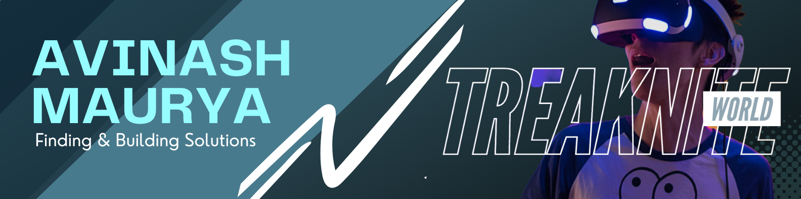

<!-- =============================== -->
<!-- Primary Banner -->
<!-- =============================== -->
<picture>
    
</picture>

<h1 align="center"> Hey, I'm <strong><a href="https://razorblack.me" target="_blank">Avinash Maurya</a></strong></h1>
<h3 align="center">Software Engineer • Problem Solver • Lifelong Learner</h3>

    
    
    
    
    
    

---

## 📌 Table of Contents
1. [About Me](#about-me)
2. [Snapshot](#snapshot)
3. [Tech Stack](#tech-stack)
4. [Experience & Achievements](#experience--achievements)
5. [GitHub Metrics](#github-metrics)
6. [Support & Contact](#support--contact)

---

## About Me

<table width="100%" cellspacing="0" cellpadding="0" style="border:none; border-collapse:collapse;">
    <tr style="border:none;">
        <td valign="top" style="border:none; padding-right:18px;">
            
Passionate about designing scalable systems and crafting clean, maintainable solutions. I enjoy exploring new technologies, refactoring legacy code, and solving real-world problems with a mix of pragmatism and curiosity. Currently focused on strengthening full‑stack development skills and deepening knowledge in system design & developer tooling.

            
<strong>What drives me:</strong> continuous learning, collaboration, and building tools or products that improve developer & user experience.

        </td>
        <td width="34%" align="center" valign="top" style="border:none;">
            
        </td>
    </tr>
</table>

---

## Snapshot
| 🎯 Focus | 🚀 Strengths | 🧪 Exploring | 🤝 Open To |
|---------|--------------|-------------|-----------|
| Full Stack & Tooling | Problem Solving, Clean Code | Cloud / DevOps Enhancements | Collaboration, Open Source |

---

## Tech Stack
> See extended list in [`docs/markdown/Skills.md`](./docs/markdown/Skills.md)

<strong>Core Languages & Runtime</strong>

    
    
    
    
    
    

<strong>Platforms / Tools</strong>

    
    

<strong>Currently Learning</strong>

- Advanced backend architecture patterns
- Cloud deployment workflows
- Performance profiling & observability

---

## Experience & Achievements
Structured details live in [`docs/markdown/Experience.md`](./docs/markdown/Experience.md).

- Built and iterated on multi-language projects (Java, Python, JS)
- Practicing clean code principles & version control discipline
- Engaged in continuous upskilling & knowledge sharing

---

## GitHub Metrics

    
    
    

<strong>Additional Badges</strong>

    
    
    

---

## Support & Contact

    <strong>Reach out:</strong> <a href="mailto:contact@razorblack.me">contact@razorblack.me</a> • <a href="https://blog.razorblack.me">Blog</a> • <a href="https://www.linkedin.com/in/thisisaviii">LinkedIn</a> • <a href="https://twitter.com/thisisaviii">Twitter/X</a>

    <!-- Uncomment if you add a donation link -->
    <!--  -->

<em>Crafted with curiosity & constant iteration.</em>

---

Last updated: <!-- DATE_PLACEHOLDER --> 2025-10-02
